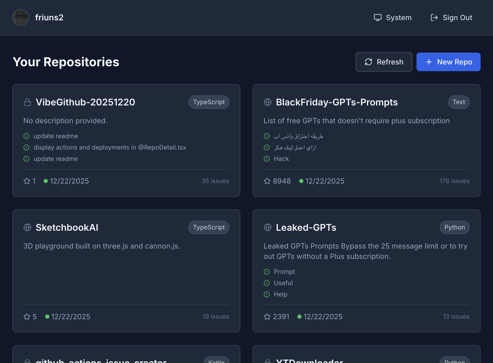
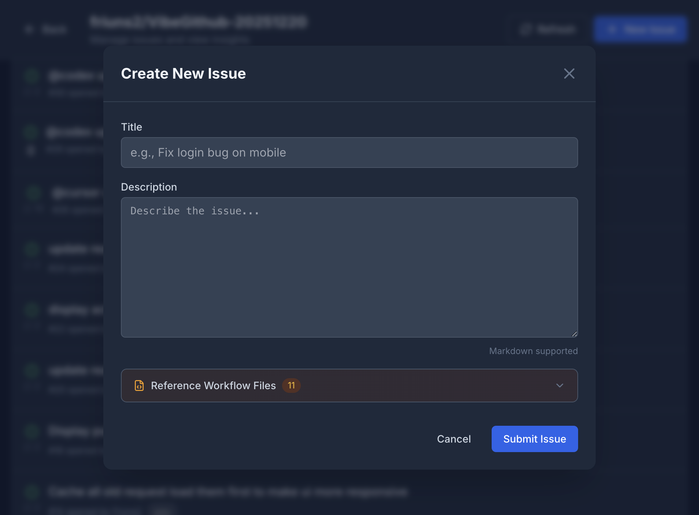
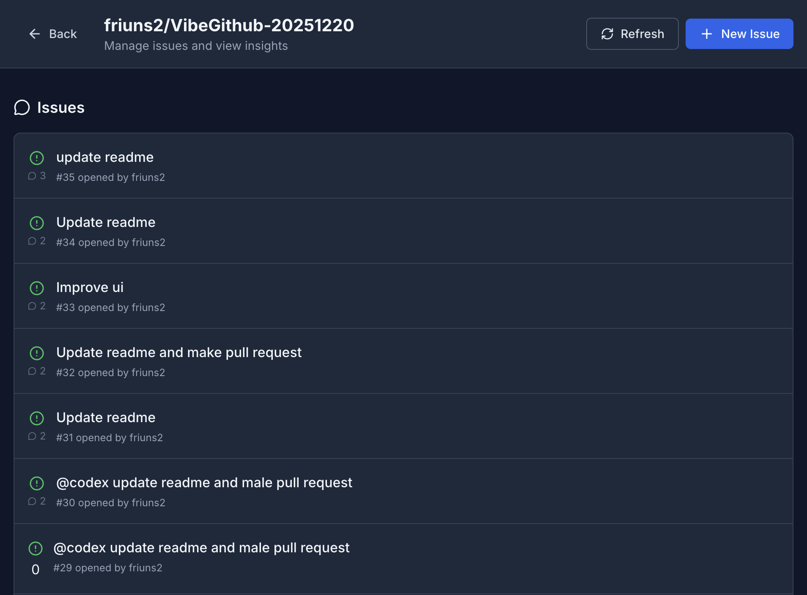

# VibeGithub

> **A vibe-coded GitHub wrapper for commanding AI coding agents (Jules, GitHub Copilot) directly from issues**



VibeGithub is a modern interface for managing GitHub repositories with native AI agent integration. Create issues that automatically trigger AI coding agents like **Jules** and **GitHub Copilot** to work on your codebase.

## What It Does

- **Command AI Agents from Issues** — Create issues that automatically assign to AI agents with proper labels
- **@jules Integration** — Comment on PRs with `@jules` mentions to request changes or reviews
- **@copilot Assignment** — New issues are auto-assigned to GitHub Copilot for automated work
- **Workflow References** — Link to CI/CD workflows when creating issues so agents understand your pipeline


## Key Features

### Issue → Agent Pipeline

When you create an issue, it automatically:
1. Adds the `jules` label for agent tracking
2. Assigns `@copilot` as the default assignee
3. Lets you reference workflow files for context



### Related PR Tracking

View PRs that reference your issue, with:
- One-click merge buttons
- Direct `@jules` commenting for agent commands
- Deployment status tracking
- GitHub Actions run visibility

### Comment with @jules

From any related PR, type your command and click "Send @jules" to:
- Request code changes
- Ask for reviews
- Trigger specific actions

## Screenshots

| Dashboard | Repo Issues |
|-----------|-------------|
|  |  |

| Create Issue | Issue Modal |
|--------------|-------------|
|  |  |

## Quick Start

```bash
# Clone and install
git clone https://github.com/yourusername/VibeGithub.git
cd VibeGithub
npm install

# Run development server
npm run dev
```

Open `http://localhost:3000` and sign in with GitHub.

## Setup

### Firebase Configuration

1. Create a project at [Firebase Console](https://console.firebase.google.com/)
2. Enable GitHub authentication under **Authentication > Sign-in method**
3. Update `services/firebaseService.ts` with your config:

```typescript
const firebaseConfig = {
  apiKey: "YOUR_API_KEY",
  authDomain: "YOUR_PROJECT.firebaseapp.com",
  projectId: "YOUR_PROJECT_ID",
  // ... rest of config
};
```

### GitHub OAuth

1. Go to [GitHub Developer Settings](https://github.com/settings/developers)
2. Create an **OAuth App** with callback: `https://YOUR_PROJECT.firebaseapp.com/__/auth/handler`
3. Add Client ID and Secret to Firebase GitHub provider settings

## How Agent Integration Works

### Creating Agent-Ready Issues

Issues created through VibeGithub are pre-configured for AI agent consumption:

```typescript
// From RepoDetail.tsx
const createdIssue = await createIssue(token, repo.owner.login, repo.name, {
  title: newTitle,
  body: newBody,
  labels: ['jules'],      // Auto-labeled for Jules
  assignees: ['copilot']  // Auto-assigned to Copilot
});
```

### Commenting to @jules on PRs

From the issue detail view, you can send commands to Jules on any related PR:

```typescript
// From IssueDetail.tsx
const body = `${userComment.trim()} @jules`;
await createIssueComment(token, repo.owner.login, repo.name, prNumber, body);
```

## Project Structure

```
├── App.tsx                 # Main routing
├── components/
│   ├── Button.tsx
│   ├── Markdown.tsx
│   ├── RepoCard.tsx        # Repo card with issue previews
│   └── Toast.tsx
├── services/
│   ├── firebaseService.ts  # GitHub OAuth via Firebase
│   ├── githubService.ts    # GitHub API (issues, PRs, workflows)
│   └── cacheService.ts     # Local caching for fast UX
├── views/
│   ├── TokenGate.tsx       # Login page
│   ├── Dashboard.tsx       # Repository list
│   ├── RepoDetail.tsx      # Issues + New Issue modal
│   └── IssueDetail.tsx     # Issue view + @jules commenting
└── types.ts
```

## Tech Stack

- **React 18** + TypeScript
- **Vite** for fast builds
- **Tailwind CSS** for styling
- **Firebase Auth** for GitHub OAuth
- **GitHub REST API** for repository operations

## License

MIT
